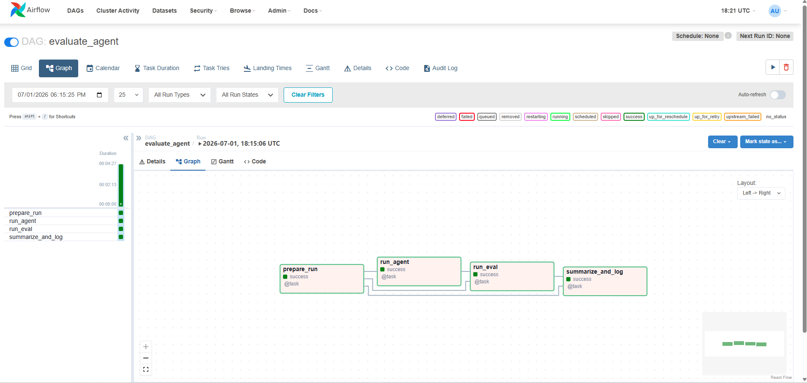
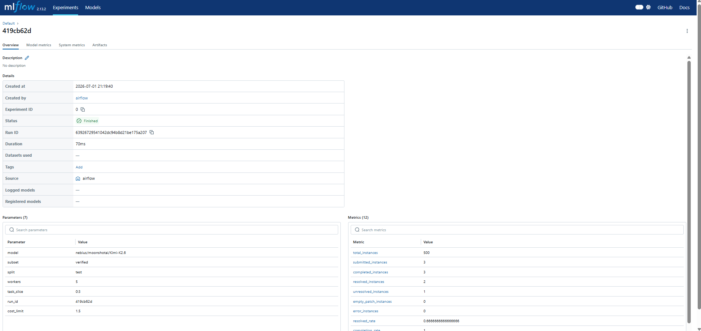

# Evaluation Pipeline Report (HW3)
### Author: Omri Levi

## Architecture

The pipeline turns the ad-hoc evaluation scripts into an automated, observable Airflow DAG backed by Docker Compose.

```
┌────────────────────────────────────────────────────────────────┐
│  Docker Compose (on Nebius VM)                                 │
│                                                                │
│  ┌──────────────┐    ┌──────────────┐     ┌─────────────────┐  │
│  │  PostgreSQL  │◄───│   Airflow    │     │     MLflow      │  │
│  │              │    │  Webserver + │────►│  (port 5000)    │  │
│  │              │    │  Scheduler   │     │                 │  │
│  │  - airflow   │    │  (port 8080) │     │  backend: PG    │  │
│  │  - mlflow    │    └──────┬───────┘     │  artifacts:     │  │
│  │    databases │           │             │  named volume   │  │
│  └──────────────┘           │             └─────────────────┘  │
│                             │ DooD                             │
│                             ▼ /var/run/docker.sock             │
│                       swebench harness                         │
│                       (spawns Docker containers per task)      │
└────────────────────────────────────────────────────────────────┘
```

**Services:**
- `postgres` - shared database backend for both Airflow metadata and MLflow tracking
- `mlflow` - MLflow 2.13.2 tracking server (`python:3.11-slim` base image)
- `airflow-webserver` / `airflow-scheduler` - Airflow 2.8.4 on Python 3.10 (custom image `Dockerfile.airflow`)
- `volumes-init` - one-shot busybox container that fixes permissions on shared volumes

**Key design decisions:**
- Docker-out-of-Docker (DooD): `/var/run/docker.sock` is mounted into Airflow containers so `swebench` can spin up evaluation Docker containers directly on the host. The Airflow user is added to the host's `docker` group via `group_add`.
- Shared `mlflow-artifacts` named volume: both the `mlflow` server and the Airflow workers mount it, so `mlflow.log_artifact()` writes to the same filesystem path the MLflow server serves from.
- MLflow 2.13.2 on `python:3.11-slim`: avoids 3.x security middleware (`--allowed-hosts`) and `pkg_resources` issues introduced in Python 3.12.
- `requests==2.31.0` pinned in the Airflow image to keep it compatible with `docker-py` 7.x.

---

## DAG: `evaluate_agent`

Located at `dags/evaluate_agent.py`. Four tasks chained in sequence:

```
prepare_run → run_agent → run_eval → summarize_and_log
```

| Task | What it does | Timeout | Retries |
|---|---|---|---|
| `prepare_run` | Builds `run_config` from params, creates `runs/<run_id>/config.json` | 2 min | 1 (delay 1 min) |
| `run_agent` | Runs `mini-swe-agent` via `uv run mini-extra swebench …`, writes trajectories + `preds.json` | 3 h | 1 (delay 5 min) |
| `run_eval` | Runs `swebench.harness.run_evaluation` against `preds.json`, writes logs + reports | 1 h | 2 (delay 2 min) |
| `summarize_and_log` | Parses results JSON, writes `metrics.json` + `manifest.json`, logs to MLflow | 10 min | 2 (delay 1 min) |

### DAG Parameters

| Parameter | Default | Description |
|---|---|---|
| `model` | `nebius/moonshotai/Kimi-K2.6` | Inference model ID |
| `subset` | `verified` | SWE-bench subset |
| `split` | `test` | Dataset split |
| `workers` | `5` | Parallel evaluation workers |
| `task_slice` | `0:3` | Python-style slice of tasks to run |
| `run_id` | _(auto-generated)_ | 8-char UUID prefix; pass a value to resume/reproduce |
| `cost_limit` | `1.5` | Per-run cost cap in USD (`"0"` = no limit) |

---

## How to Deploy

### Prerequisites

```bash
# On the Nebius VM: Docker must be installed and your user in the docker group
# Clone the repo and enter it
git clone <repo-url>
cd mlops-assignment-e2e-ml-pipeline
cp .env.example .env
# Fill in your NEBIUS_API_KEY in .env
```

### Start all services

```bash
docker compose up --build -d
```

Wait ~60–90 seconds for all healthchecks to pass, then:
- Airflow UI: `http://<vm-ip>:8080` (admin / admin)
- MLflow UI:  `http://<vm-ip>:5000`

### After VM restart

`postgres` and `mlflow` do not have `restart: always`, so after a VM reboot run:
```bash
docker compose up -d
```

### Tear down (keep data)

```bash
docker compose down
```

### Full reset (wipe all data)

```bash
docker compose down -v
```

---

## How to Trigger a Run via Airflow UI:

1. Open `http://<vm-ip>:8080`
2. Find the `evaluate_agent` DAG and unpause it (toggle top-left)
3. Click **Trigger DAG w/ config** (play button ▶ → "Trigger DAG w/ config")
4. Edit the JSON params as needed, then click **Trigger**


## Artifact Layout

Every run writes a self-contained directory:

```
runs/
  <run-id>/
    config.json          # all input parameters
    metrics.json         # resolved_rate, completion_rate, error_rate, etc.
    manifest.json        # paths to every artifact in this run
    run-agent/
      preds.json         # model predictions (input to swebench eval)
      <task-id>/         # per-task trajectory folders
        ...
    run-eval/
      <model>.<hash>.json  # swebench results summary
      logs/                # harness logs per task
```

**To reconstruct a run from its `run-id`:**
```bash
ls runs/<run-id>/
cat runs/<run-id>/config.json    # what was run
cat runs/<run-id>/metrics.json   # what happened
cat runs/<run-id>/manifest.json  # where everything is
```

The `manifest.json` records absolute paths to config, predictions, trajectories, eval dir, and metrics, so a teammate can inspect any aspect of the run by `run-id` alone.

---

## MLflow Tracking

MLflow server: `http://<vm-ip>:5000`

Each DAG run logs one MLflow run under the **Default** experiment:
- **Params**: all DAG params (`model`, `subset`, `split`, `workers`, `task_slice`, `run_id`, `cost_limit`)
- **Metrics**:
  - `resolved_rate` - fraction of submitted instances where the patch passed all tests
  - `completion_rate` - fraction of submitted instances the agent attempted
  - `error_rate` - fraction that errored
  - `empty_patch_rate` - fraction where the agent produced no patch
  - `resolved_of_completed` - resolved / completed (excludes errors)
  - Raw counts: `total_instances`, `submitted_instances`, `completed_instances`, `resolved_instances`, `unresolved_instances`, `empty_patch_instances`, `error_instances`
- **Artifacts**: `config.json`, `metrics.json`, `manifest.json` uploaded to the shared `mlflow-artifacts` volume

To compare multiple runs, open MLflow → Default experiment → select runs → Compare.

---

## Completed Example Run

Run ID: `419cb62d` — artifacts at `runs/419cb62d/`

| Parameter | Value |
|---|---|
| Model | `nebius/moonshotai/Kimi-K2.6` |
| Subset | `verified` |
| Split | `test` |
| Task slice | `0:3` (3 tasks) |
| Workers | 5 |
| Cost limit | 1.50 |

| Metric | Value |
|---|---|
| `resolved_rate` | 0.6667 (2/3 tasks resolved) |
| `completion_rate` | 1.0 (all 3 tasks completed) |
| `error_rate` | 0.0 |
| `empty_patch_rate` | 0.0 |
| `submitted_instances` | 3 |
| `resolved_instances` | 2 |
| `unresolved_instances` | 1 |

**Airflow DAG: a completed run:**



**MLflow: logged runs:**



---

## Execution Isolation

Agent and evaluation steps run inside the Airflow container (which has `mini-swe-agent` and `swebench` installed via pip). The `swebench` harness itself spawns Docker containers on the host via the mounted Docker socket (DooD), so each task evaluation runs in a fresh, isolated environment matching the upstream SWE-bench harness requirements.

For full `DockerOperator` isolation (Phase 3 in the README roadmap), each Airflow task would be replaced by a `DockerOperator` call using the project `Dockerfile`, eliminating the need to install agent/eval deps inside the Airflow image.

---

## How to Rerun by `run-id`

Pass an existing `run-id` as the `run_id` DAG param to overwrite the run directory:

```bash
docker compose exec airflow-webserver airflow dags trigger evaluate_agent \
  --conf '{"run_id":"<your-run-id>","task_slice":"0:3",...}'
```

Or start fresh (leave `run_id` empty) to auto-generate a new ID.

---

## Object Storage (S3) - How It Would Work

Remote artifact storage is skipped in this iteration (requires admin permissions on the Nebius account). The local `runs/<run-id>/` folder is the durable artifact store instead. Here is how uploading would be wired in if Object Storage were available:

**1. Upload step in `summarize_and_log`**

After writing `metrics.json` and `manifest.json`, add an upload call before logging to MLflow:

```python
import boto3, tarfile, os

def upload_run_to_s3(run_dir: Path, run_id: str, bucket: str) -> str:
    """Tar the run directory and upload to S3. Returns the S3 URI."""
    archive = run_dir.parent / f"{run_id}.tar.gz"
    with tarfile.open(archive, "w:gz") as tar:
        tar.add(run_dir, arcname=run_id)
    s3 = boto3.client(
        "s3",
        endpoint_url=os.environ["S3_ENDPOINT_URL"],  # e.g. https://storage.eu-north1.nebius.cloud
        aws_access_key_id=os.environ["S3_ACCESS_KEY"],
        aws_secret_access_key=os.environ["S3_SECRET_KEY"],
    )
    key = f"mlops-runs/{run_id}.tar.gz"
    s3.upload_file(str(archive), bucket, key)
    return f"s3://{bucket}/{key}"
```

**2. Log the S3 URI to MLflow**

Pass the returned URI into `write_manifest` and `log_mlflow_run`:

```python
artifact_uri = upload_run_to_s3(run_dir, run_config["run_id"], bucket="mlops-artifacts")
manifest_path = write_manifest(run_config, eval_path, artifact_uri=artifact_uri)
mlflow.log_param("artifact_uri", artifact_uri)
```

The `manifest.json` already has an `artifact_uri` field for this, which is `null` in local-only runs.

**3. Additional `.env` variables needed**

```
S3_ENDPOINT_URL=https://storage.eu-north1.nebius.cloud
S3_BUCKET=mlops-artifacts
S3_ACCESS_KEY=...
S3_SECRET_KEY=...
```

**4. Rehydrating a run from S3**

```bash
aws s3 cp s3://mlops-artifacts/mlops-runs/<run-id>.tar.gz . --endpoint-url $S3_ENDPOINT_URL
tar -xzf <run-id>.tar.gz
cat <run-id>/manifest.json
```

---

## Environment Variables (`.env`)

| Variable | Required | Purpose |
|---|---|---|
| `NEBIUS_API_KEY` | ✅ | Nebius Token Factory key for inference. |
| `AIRFLOW_UID` | No | UID of the Airflow process. Defaults to `50000`; set to `$(id -u)` on Linux to match your host user. |
| `POSTGRES_USER` | No | PostgreSQL username. Defaults to `airflow`. |
| `POSTGRES_PASSWORD` | No | PostgreSQL password. Defaults to `airflow` — change in any non-local deployment. |
| `POSTGRES_DB` | No | PostgreSQL database name for Airflow. Defaults to `airflow`. |
| `AIRFLOW__WEBSERVER__SECRET_KEY` | No | Flask secret key for the Airflow webserver. Defaults to `changeme` — always override in production. |
| `AIRFLOW__CORE__FERNET_KEY` | No | Key used to encrypt Airflow connection passwords. Defaults to a pre-generated key — always override in production. Generate a new one with: `python3 -c "from cryptography.fernet import Fernet; print(Fernet.generate_key().decode())"` |

Copy `.env.example` to `.env`, fill in `NEBIUS_API_KEY`, and override the secrets for any non-local deployment.
